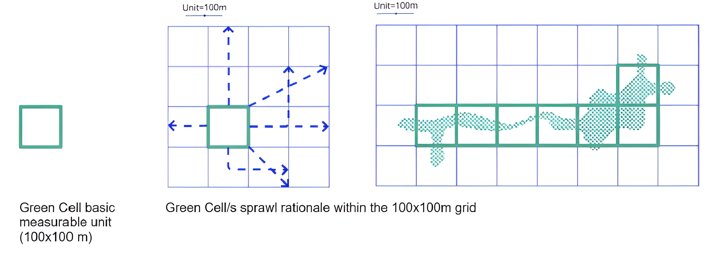

<div align="center">
  
</div>

<div align="center">
  <a href="https://www.linkedin.com/in/christiandibuo/" target="_blank">Christian Di Buò</a> &nbsp; | &nbsp;
  <a href="https://www.linkedin.com/in/simreale" target="_blank">Simone Reale</a>
</div>

# Sustainable City via Trustworthy Digital Twin: a Use Case

Bologna, like many European cities, faces growing challenges from climate change, biodiversity loss, pollution, and unequal access to public space. 
Problems like Urban Heat Islands (UHI) and Urban Heat Waves (UHW) particularly threaten vulnerable communities, straining public health and reducing quality of life. 

To address these issues, the __*TALEA*__ project, supported by the *European Urban Initiative – Innovative Actions (EUI-IA)*, introduces **TALEA Green Cells (TGCs)**: modular, adaptable green units that reconnect fragmented green areas, regenerate underutilized spaces, and create local climate refuges.

<div align="center">
  
</div>

This repository presents a **transparent methodology for planning TGCs placement in Bologna**, relying on **interpretable AI optimization techniques**. The workflow combines open-source urban and demographic data with optimization-based modeling to explore how the distribution of Green Cells shifts under factors such as *population density*, *urban indices* or *land use*.

## Data

### Land Usage Dataset

<br>

<div style="display:flex;align-items:center;gap:25px;">
    
    <div>
        <a href="https://geoportale.regione.emilia-romagna.it/approfondimenti/database-uso-del-suolo" target="_blank"><h4>Urban fabric</h4></a>
        <ul>
            <li>Mapping of the various uses of the territory, classified according to a hierarchical legend derived from the specifications of the European project Corine Land Cover (CLC), integrated by the Land Use Working Group of CPSG-CISIS.</li>
        </ul>
    </div>
</div>

<br>

### Green Cover Dataset

<br>

<div style="display:flex;align-items:center;gap:25px;">
    
    <div>
        <a href="https://opendata.comune.bologna.it/explore/dataset/un_gest/information/?flg=it-it&disjunctive.classe_unita_gestionale&disjunctive.area_statistica&disjunctive.zona_prossimita&disjunctive.quartiere" target="_blank"><h4>Municipal Green</h4></a>
        <ul>
            <li>Green units under the maintenance of the Bologna Municipality, including a wide range of categories, like flowerbeds, gardens, parks, ponds, school and sports green areas, roadside decorative greenery, etc.</li>
        </ul>
        <a href="https://opendata.comune.bologna.it/explore/dataset/verde_privato_urbanizzato/information/?flg=it-it" target="_blank"><h4>Private Green</h4></a>
        <ul>
            <li>Mapping of the private green areas within the Bologna cityscape.</li>
        </ul>
        <a href="https://opendata.comune.bologna.it/explore/dataset/alberi-manutenzioni/information/?flg=it-it&disjunctive.cl_h&disjunctive.dimora&disjunctive.classe&disjunctive.zona_di_prossimita&disjunctive.area_statistica" target="_blank"><h4>Municipal Trees</h4></a>
        <ul>
            <li>Mapping of the trees planted in the Bologna cityscape, containing the coordinates of each element and the information about the type of tree.</li>
        </ul>
    </div>
</div>

<br>

<div style="display:flex;align-items:center;gap:25px;">
    
    <div>
        <a href="https://geoportale.regione.emilia-romagna.it/catalogo/dati-cartografici/ambiente/carte-forestali/provincia-di-bologna" target="_blank"><h4>Forestal scape</h4></a>
        <ul>
            <li>Landscape area covered by tree and/or shrub and/or bush vegetation of forest species, whether of natural or artificial origin, at any stage of development, with a density greater than 10%.</li>
        </ul>
        <a href="https://geoportale.regione.emilia-romagna.it/catalogo/dati-cartografici/acque-interne" target="_blank"><h4>Riverscape</h4></a>
        <ul>
            <li>Landscape area covered by water, including rivers, riverbeds and lakes.</li>
        </ul>
    </div>
</div>

<br>

### Human Infrastructure

<br>

<div style="display:flex;align-items:center;gap:25px;">
    
    <div>
        <a href="https://opendata.comune.bologna.it/explore/dataset/rifter_edif_pl/information/?flg=it-it" target="_blank"><h4>CTC - Particle Buildings</h4></a>
        <ul>
            <li> Mapping of buildings with parcel details extracted from the Municipal Technical Map and public cadastral information (Sheet/Parcel).</li>
        </ul>
        <a href="https://opendata.comune.bologna.it/explore/dataset/aree-stradali/information/?flg=it-it&disjunctive.descrizion&disjunctive.origine" target="_blank"><h4> CTC - Road Area</h4></a>
        <ul>
            <li>Street areas in the city of Bologna, including all the different types of roads, parking areas and squares, extracted from the Municipal Technical Map.</li>
        </ul>
    </div>
</div>

<br>

### Statistical Data

<br>

<div style="display:flex;align-items:center;gap:25px;">
    
    <div>
        <a href="https://opendata.comune.bologna.it/explore/dataset/aree-statistiche/information/?flg=it-it" target="_blank"><h4>Statistical Areas</h4></a>
        <ul>
            <li>Division of the municipal territory into 90 statistical areas, more detailed way than the traditional division of Bologna into districts or zones.</li>
        </ul>
        <a href="https://inumeridibolognametropolitana.it/dati-statistici/popolazione-residente-quartiere-zona-e-area-statistica-al-31-dicembre" target="_blank"><h4>Population per statistical area</h4></a>
        <ul>
            <li>Dataset of the population density of Bologna, computed at different levels of granularity (districts, city zones and statistical areas).</li>
        </ul>
    </div>
</div>

<br>

<div style="display:flex;align-items:center;gap:35px;">
    
    <div>
        <a href="https://github.com/TALEA-platform/uhi" target="_blank"><h4>Urban Heat Island Analysis</h4></a>
        <ul>
            <li>Analysis of the Urban Heat Island (UHI) effects in the city of Bologna, by processing and integrating satellite data from Landsat 8/9 and MODIS with spatial indicators like NDVI, LST, Albedo, and derived composite indices.</li>
        </ul>
    </div>
</div>

<br>

## Models

The placement of TGCs is modeled as a **Combinatorial Optimization Problem (COP)** and relies on the impact of different factors on *micro* and *macro scale* and on how fragmented each area is.

The *macro scale* is referred to the statistical areas, where three indices are considered:
- *population density*
- *existing green*
- *UHEI*

The *micro scale* is referred to the grid of 100x100 m cells, and is modeled differently according to four different approaches:

| Standard | Difference | Inverse UHEI | NDVI |
|:--------------:|:--------------:|:--------------:|:--------------:|
|It aims to maximize a utility function, which is directly proportional to new green areas and inversely to existing ones. |Based on the same concept of the Standard one, it considers the impact of the existing green in a differential way. |It maximizes the impact of the FVC on the Inverse UHEI, directly w.r.t. new TGCs and inversely to the existing vegetation. |It maximizes the impact of the FVC on the NDVI, according to a quadratic relation, inversely proportional to the actual NDVI of the cell. |

> [!NOTE]
> Further details on models, indices and sources of this study can be found in the **report** and in the **documentation**.

## Usage

To reproduce our results, ensure Docker is installed on your system. Once Docker is installed, to run the docker the following scripts should be executed from the terminal while in the Dockerfile directory:

- To build and run the docker

    ```
    docker-compose up --build -d
    ```

- To exec docker commands from your terminal

    ```
    docker exec -it TALEA bash
    ```

### Rules

There are two modalities to run the pipeline in the docker shell:

- one for running the entire pipeline, including the grid creation step, necessary for the first run, after changing the size and for changing something in the geometry of data

    ```bash
    run_pipeline
    ```

- one for running only the further processing steps, including the instance creation and the solver, used for changing parameter configuration

    ```bash
    run_model
    ```

> [!TIP]
> Run the `--help` option on each command for further details on usage and parameters configuration.

## Useful Links

This project relies on spatial data, which is best understood when visualized and exploring them in tables often leads to ambiguity and poor clarity. Therefore, a simple **Graphical User Interface (GUI)** has been implented to display GeoJson files.

<div align="center">
  <a href="https://talea-gui.netlify.app/">
    
  </a>
</div>
<br>

Furthermore, any step of the process is explained in a **report** and a **documentation** that follows the ReadTheDocs format, including further details on data, models and the results obtained.

<div align="center">
  <a href="TALEA_report.pdf">
    
  </a>
    &nbsp;
  <a href="https://talea-documentation.netlify.app/">
    
  </a>
</div>
<br>

## Citation

If you use this work or code for any purpose, please cite the following paper:
```
@INPROCEEDINGS{Borg2603:Sustainable,
AUTHOR="Christian {Di Buò} and Simone Reale and Roberta Calegari and Andrea
Borghesi",
TITLE="Sustainable City via Trustworthy Civic Digital Twin: a Use Case",
BOOKTITLE="DIGITA 2026 - Second Workshop on Digital Twin Ecosystems \& Applications
(DIGITA 2026)",
ADDRESS="Pisa, Italy",
PAGES=6,
DAYS=15,
MONTH=mar,
YEAR=2026,
KEYWORDS="Civic Digital Twins; Sustainability; Heat Exposure; Green Cells Placement",
ABSTRACT="Cities increasingly face urban heat and uneven access to green space. We
present a Digital Twin and an interpretable optimization framework that
recommends where to deploy modular green cells in Bologna, Italy. We fuse
municipal open data-land use, public/private green and blue areas,
buildings and roads-with satellite-derived heat and greenness indices
(UHEI, NDVI) and demographics into a grid structure. We then cast site
selection as a constraint optimization problem whose utility factorizes
into a macro component (policy levers over density,
heat exposure, and existing green) and a micro component (site-level
feasibility and expected impact). Scenario analyses show how shifting
policy priorities redistribute optimal placements across districts. The
suggestions from the model overlap with pilot areas identified by urban
experts, supporting practical relevance. The entire stack is containerized
for reproducibility and includes a lightweight GUI for spatial inspection.
We release all artifacts to foster the sustainability-driven Digital Twin
methods that are transparent, adaptable, and action-oriented."
}
```
