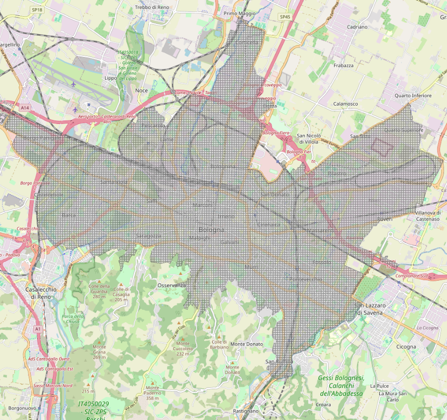

Data
============

Data Collection
------------------

Data collection is one of the most important part of this project. Aiming to insert new green areas in the city of Bologna, it is necessary to have
information about the already present green space, the human infrastructures and the population.
This information have been gathered from `Open Data Bologna <https://opendata.comune.bologna.it/>`_ and 
`Geoportale Emilia Romagna <https://geoportale.regione.emilia-romagna.it/>`_.
Open Data Bologna, so as Geoportale Emilia Romagna, is an initiative which aims to collect and make the data of the city public, respecting the 
Italian and European directive about the open data. 
In this study we used the followings' dataset:

- :doc:`General information about Bologna land usage <script/data/land_usage>`
- :doc:`Green datasets <script/data/green_dataset>`
- :doc:`Human infrastructure datasets <script/data/buildable>`
- :doc:`Statistical dataset <script/data/statistics>`

Those data are not thought to be used in an algorithmic contest. Indeed, they lack of a usable structure, there is no unique dataset for the same data, leading
to multiple duplicates. Furthermore, some geospatial information are corrupted and need to be refined and some data are missing, requiring modifcation which leads to non-exact solutions.
To overcome these problems a heavy processing step is required.

Preprocessing
------------------------------------
The data are not ready to use, they need to be reorganized and processed in order to extrapolate the relevant information.
One of the most useful tool to work with geospatial data is QGIS, which offers also a python interface. 
Furthermore, many datasets present overlapping information which should not be duplicated.

To understand the preprocessing steps, let's define some approximation used during the definition of this study. 
To place new green areas it is important to understand where to place them. For this purpose, it has been defined the concept of **free space**. 
The free space is the remaining space in the city, once you remove buildings, roads, all the human infrastructure and
the green space. Basically, in most of the cases it represents the yard court of the buildings.

Furthermore, it has been hypothesized that the roads are places where new green areas could be inserted. Of course, this is an approximation, 
but to make it as realistic as possible it has been decided to exclude all the squares and the highways, where it would have been
more complex (or even impossible) to build upon.

The steps done during preprocessing are the followings:

- The green datasets contents have been aggregated under a unique dataset, avoiding duplicates. In this process, it has been found that the dataset *un_gest* contains some corrupted geospatial information, causing errors in the union. Therefore, we performed a geometry fixing operation, which aims to connect this "holes" avoiding the aforementioned error;
- The road dataset also contains squares and highways in it. Since no dataset for squares is available, the attribute *'Tronco di intersezione tra strade a raso'* has been properly filterd to delete squares. Empirically, it has been found that setting a threshold which removes all the elements who's area is bigger than 7500 square meters is a good trade-off. Instead, the highways are contained in the dataset *uso_del_suolo* under the feature *"Autostrade e superstrade"*. Therefore, the roads have been filtered by performing a difference operation with the dataset *uso_del_suolo*;
- The free space has been computed by selecting the residential areas from the dataset *uso_del_suolo*, under the features *'Tessuto residenziale compatto e denso', 'Tessuto residenziale urbano', 'Tessuto residenziale rado'*. From this base, the deletion previously described has been performed, removing the green space, the roads and the buildings;
- The cityscape of Bologna has been extracted from the dataset *aree-statistiche*. However, some areas lack of information about the green space and buildings, so it has been decided to remove them. The final usable area is described in the image below.
- Once delimited the area of work, a grid of cells with dimensions 100x100 meters has been created to define where to insert the new TGCs.
- The final dataset used by the optimization model is composed of all the cells of the grid, where each of them in enriched by the area occupied by the green space, buildings, road, free space and the number of free space fragments and trees.

|
This "final dataset", only represents information under a **micro-scale** view. It's also important to have a **macro-scale** view, represented by the dataset *aree_statistiche_macro*. 
The macro scale defines the information about:

- *population density*, stored in *densità-per-area-statistica* and obtained from the division between the population from the dataset *popolazione-per-area-statistica* and the area itself;
- *green space*, contained in *aree_statistiche_stat*, resulting from the aggregation of the green space present in each area. 

The new macro dataset contains all the used "aree statistiche" with information about the population density and the green space present there.

|

.. grid:: 2

    .. grid-item::

        .. figure:: script/data/images/green_space.png
           :width: 300px

           Green areas distribution

    .. grid-item::

        .. figure:: script/data/images/population_density.png
           :width: 295px

           Population density distribution

As shown in the images above, the city center exhibits the highest population density and the lowest proportion of green areas.
Moving toward the outskirts, population density gradually decreases.
Unsurprisingly, the areas with the highest concentration of green space are the Colli.