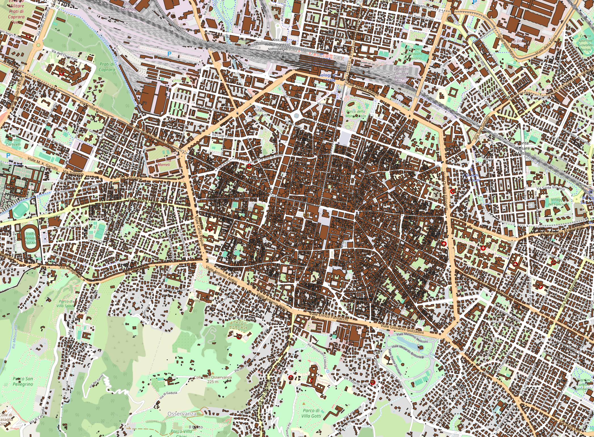
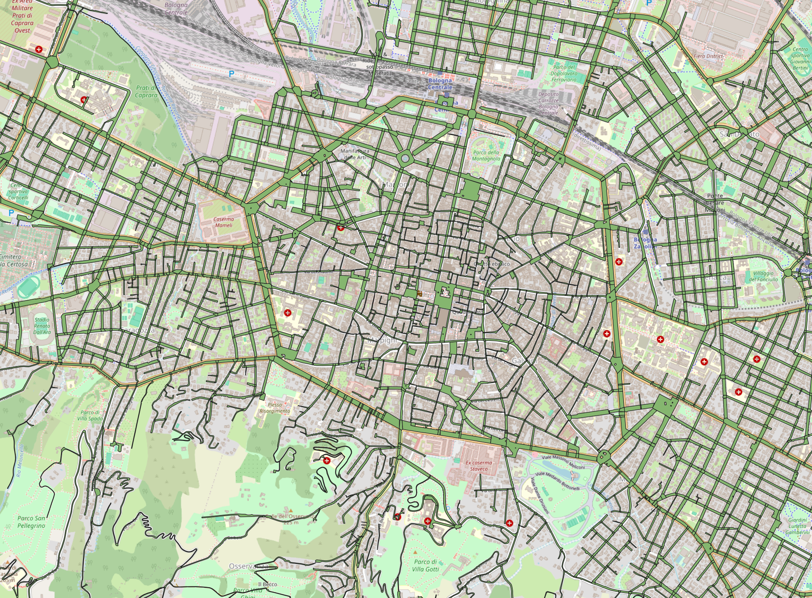

Edifici particellari
==============================
`Edifici particellari <https://opendata.comune.bologna.it/explore/dataset/rifter_edif_pl/information/>`_ contains the list of buildings with parcel details extracted from the 
Municipal Technical Map and aggregated and integrated with public cadastral information (Sheet/Parcel) from the cadastral, available 
through the WMS service of the Revenue Agency for consultation of the cadastral maps.

|

Aree stradali
===============
`Aree stradali <https://opendata.comune.bologna.it/explore/dataset/aree-stradali/information/?disjunctive.descrizion&disjunctive.origine>`_ 
contains the street areas in the city of Bologna, including all the different types of roads, parking areas and squares.

