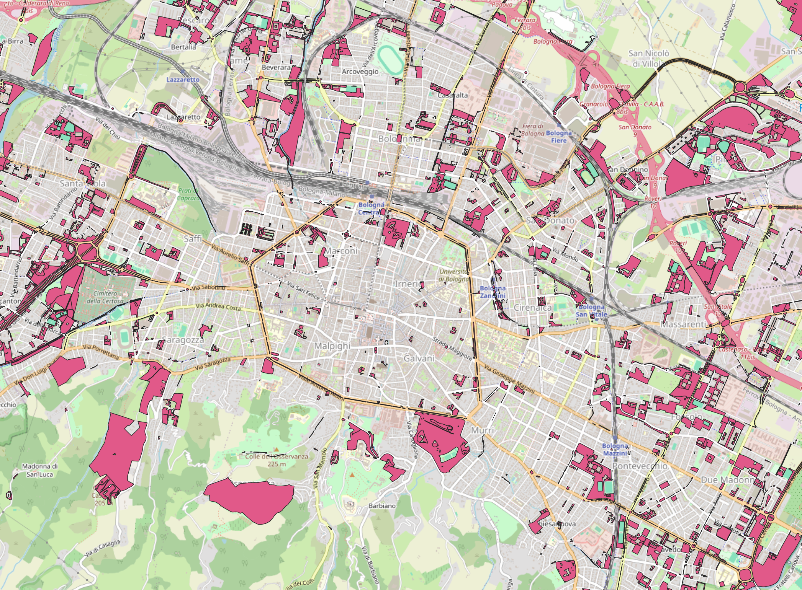
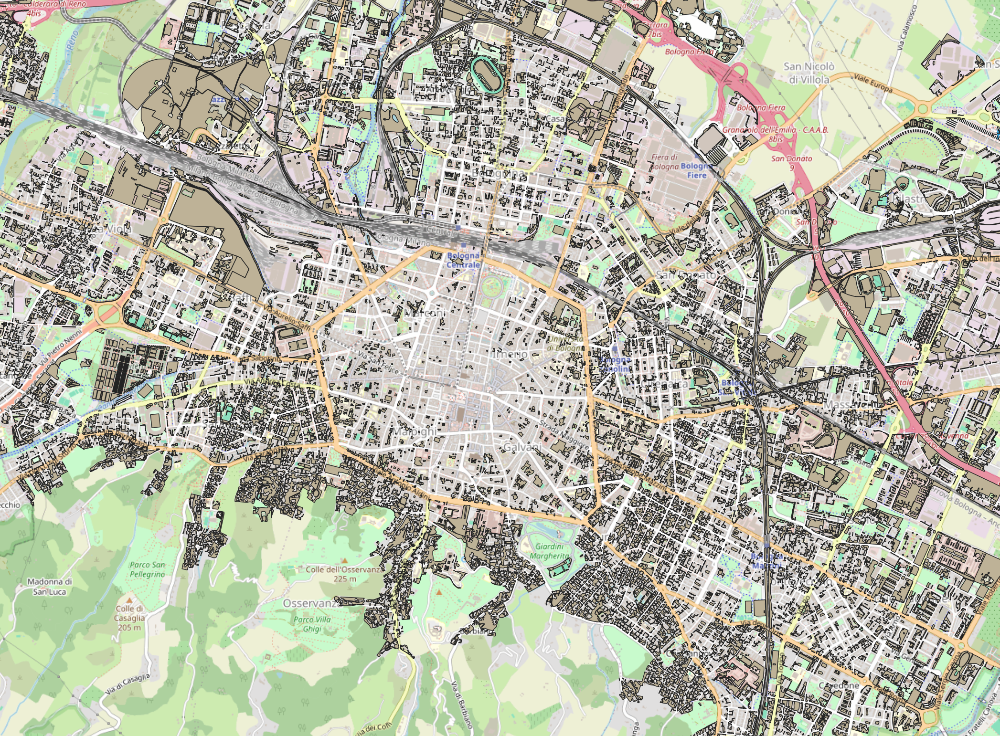
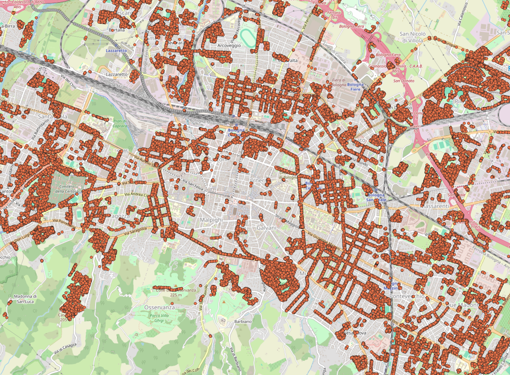
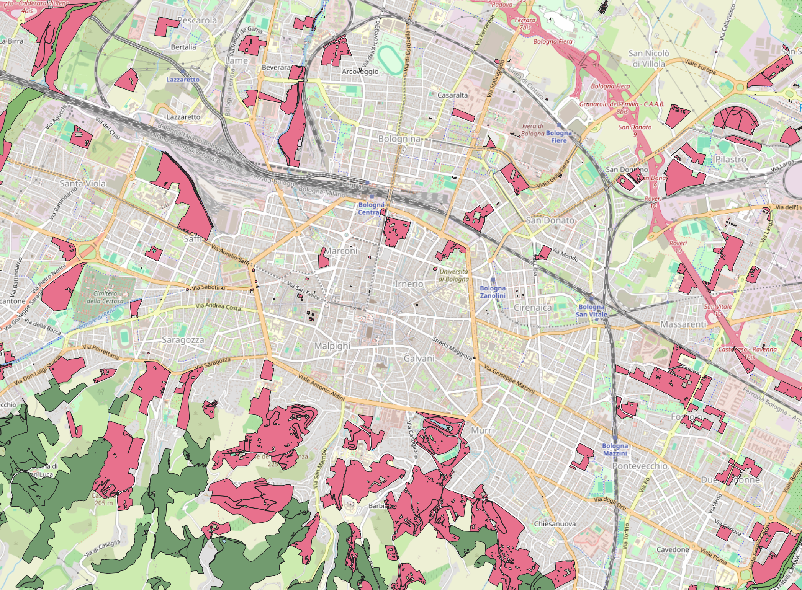

Verde in gestione
==================================
`Verde in gestione <https://opendata.comune.bologna.it/explore/dataset/un_gest/information/?disjunctive.classe_unita_gestionale&disjunctive.area_statistica&disjunctive.zona_prossimita&disjunctive.quartiere>`_ 
is located within the cityscape of the Municipality of Bologna. 
The management units under maintenance include a wide range of types, among which we highlight:

- Flowerbeds and squares;
- Gardens, parks, ponds
- School green areas and sports green areas
- Roadside decorative greenery (roundabouts, embankments, medians)

|

Verde Privato 
==================================
`Verde privato <https://opendata.comune.bologna.it/explore/dataset/verde_privato_urbanizzato/information/>`_ corresponds to the mapping of green areas within the urbanized territory, excluding public green spaces under maintenance.
This dataset with the "verde in gestione" constitutes the two main source of green spaces in the area of Bologna

|

Alberi In Manutenzione 
==================================

The dataset `alberi in manutenzione <https://opendata.comune.bologna.it/explore/dataset/alberi-manutenzioni/information/?disjunctive.cl_h&disjunctive.dimora&disjunctive.classe&disjunctive.zona_di_prossimita&disjunctive.area_statistica>`_, 
contains the information about the type of tree and the coordinates of all the trees planted in the city of Bologna.  
The idea has been to use this dataset to have a more accurate information of the green spaces already available. 
There are some areas in which we have no parks, nor gardens but there are trees, which are as important for heating and climate 
factors. 

The dataset only contains the coordinates of each trees, and estimate the ares occupied by each of them was not straightforward, and involved a too big approximation.
Therefore, the idea has been to count all the trees which do not fall inside a green space and use that count as a factor to increase the green impact.

|

Aree Boschive and Aree Fluviali
==================================
`Aree boschive <https://geoportale.regione.emilia-romagna.it/catalogo/dati-cartografici/cartografia-di-base/database-topografico-regionale/vegetazione/aree-agro-forestali/layer-2>`_ 
contains area of land covered by tree and/or shrub and/or bush vegetation of forest species, whether of natural or artificial origin, at any stage of development, with a density greater than 10%. It has been used to enlarge the amount of green space including the forest areas. 
On the other side, `Aree fluviali <https://geoportale.regione.emilia-romagna.it/catalogo/dati-cartografici/acque-interne>`_ contains the areas covered by water, including rivers, riverbeds and lakes.

In this study, it has been decided to collapse the two dataset, considering as green the so called *blue space*, too. 
There were no significant reasons to differentiate between the green and blue, also due to the absence
of a large amount of waterfall in the Bologna Municipality.

