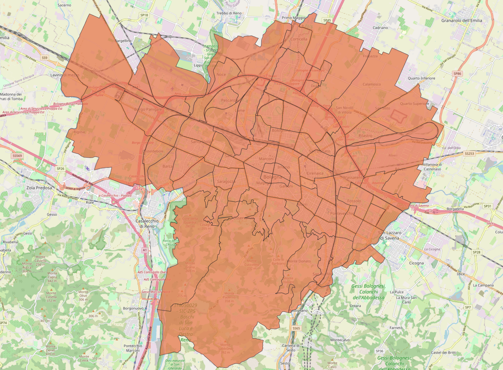

Aree statistiche
==========================

`Aree statistiche <https://opendata.comune.bologna.it/explore/dataset/aree-statistiche/information/?sort=area_statistica&basemap=jawg.light&location=12,44.4887,11.33168>`_  contains 
the division of the municipal territory into *90 statistical areas* and meets the need of a *grid* to analyze the environment in a more detailed way than the traditional division of Bologna into districts or zones, and at the same time sufficiently concise compared to the highly fragmented structure of census sections.

|

Popolazione per area statistica
==================================
`Popolazione per area statistica <https://inumeridibolognametropolitana.it/dati-statistici/popolazione-residente-quartiere-zona-e-area-statistica-al-31-dicembre>`_ contains the population density of Bologna, computed at different levels of granularity. From the most detailed to the least detailed, we have:

- *districts*, the main administrative divisions of the city;
- *city zones*, further subdivisions of the districts;
- *statistical areas*, the smallest geographic subdivisions used for data analytics.